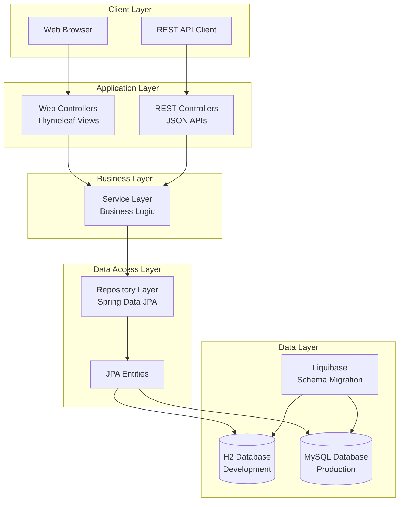
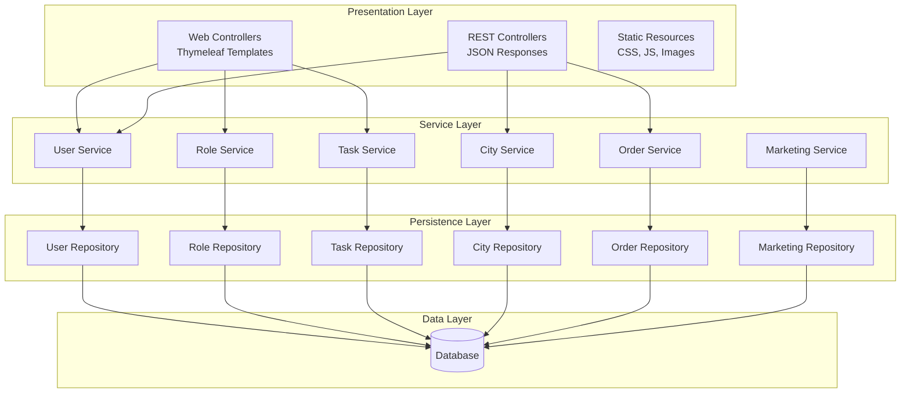
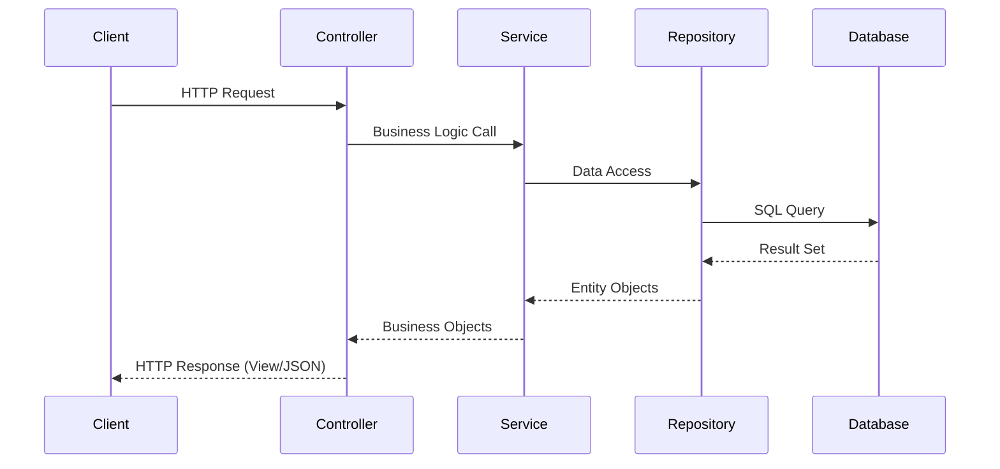
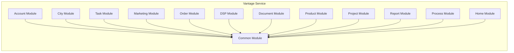
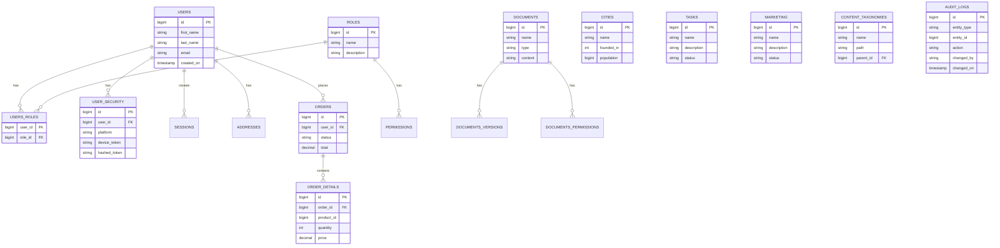
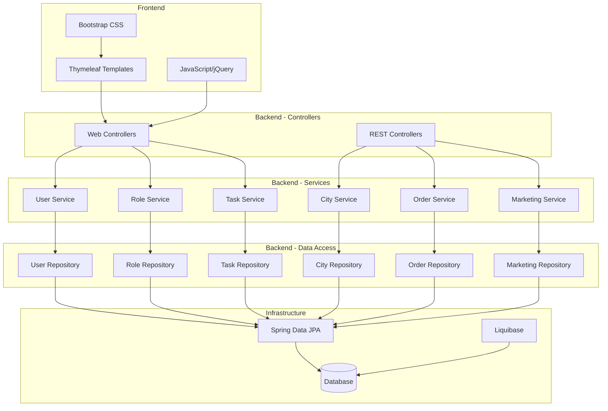
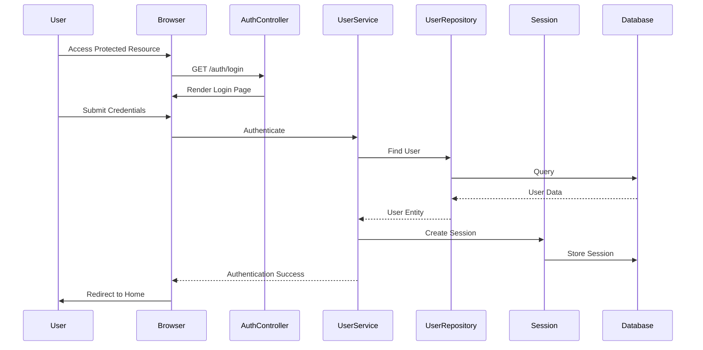
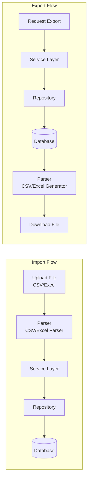
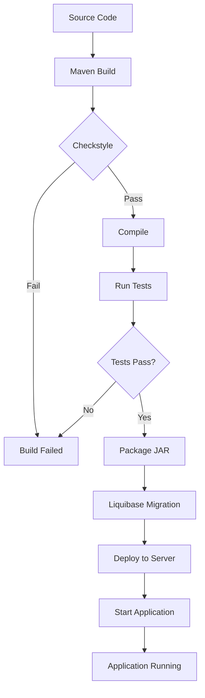
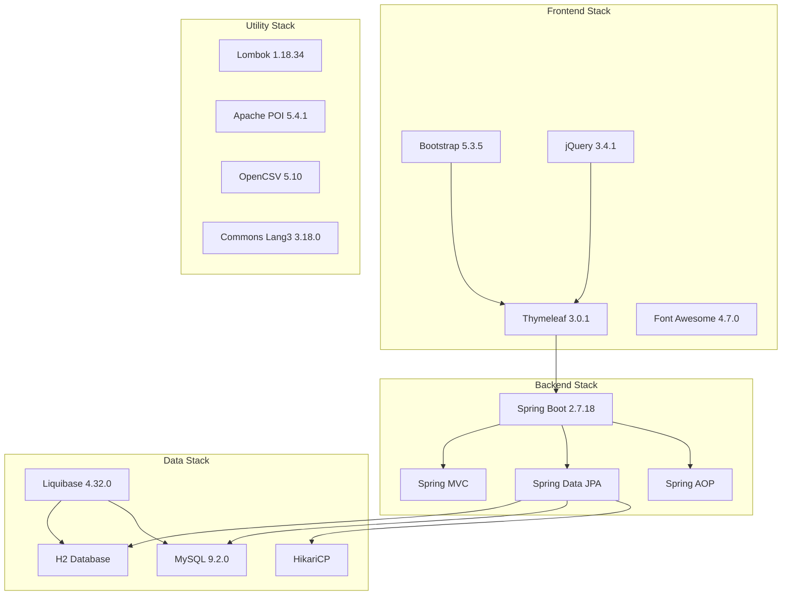

# Vantage Service - Architecture Documentation

## Overview

**Vantage Service** is a Spring Boot-based business management application that provides a comprehensive platform for managing various business entities including users, roles, tasks, marketing campaigns, cities, content taxonomies, and orders. The application follows a layered architecture pattern with clear separation of concerns.

## Architecture Diagrams

### 1. High-Level System Architecture



### 2. Layered Architecture



### 3. Request Flow Diagram



### 4. Module Structure Diagram



### 5. Database Schema Diagram



### 6. Component Interaction Diagram



### 7. Security & Authentication Flow



### 8. Data Import/Export Flow



### 9. Build & Deployment Pipeline



### 10. Technology Stack Diagram



## Technology Stack

### Core Framework
- **Spring Boot**: 2.7.18
- **Java**: 21
- **Build Tool**: Maven 3.x
- **Packaging**: JAR

### Backend Technologies
- **Spring Framework**
  - Spring Boot Starter Web (RESTful APIs)
  - Spring Boot Starter Data JPA (Database persistence)
  - Spring Boot Starter AOP (Aspect-oriented programming)
  - Spring Boot Starter Thymeleaf (Server-side templating)
- **Database**
  - H2 Database (Development/Testing)
  - MySQL 9.2.0 (Production-ready)
- **ORM**: Hibernate (via Spring Data JPA)
- **Database Migration**: Liquibase 4.32.0
- **Connection Pooling**: HikariCP

### Frontend Technologies
- **Templating Engine**: Thymeleaf 3.0.1 with Layout Dialect 3.4.0
- **CSS Framework**: Bootstrap 5.3.5
- **JavaScript Libraries**:
  - jQuery 3.4.1
  - jQuery UI 1.12.1
  - X-Editable (Bootstrap 3 compatible)
  - Font Awesome 4.7.0

### Utility Libraries
- **Lombok**: 1.18.34 (Code generation)
- **Apache Commons**: 
  - Commons Lang3 3.18.0
  - Commons CSV 1.14.0
- **CSV Processing**: OpenCSV 5.10
- **Excel Processing**: Apache POI 5.4.1 (POI & POI-OOXML)

### Custom Dependencies
- **appsuite-core**: 0.0.74 (Custom core utilities)
- **appsuite-spring**: 0.0.26 (Custom Spring integrations)

### Testing
- **JUnit Jupiter**: 5.10.2 (with parameters)
- **Spring Boot Starter Test**

### Code Quality
- **Checkstyle**: 3.5.0 (Code style enforcement)
- **Maven Checkstyle Plugin**: Integrated with remote code styles repository

## Architecture Layers

### 1. Presentation Layer

#### Web Controllers
- **Location**: `com.rslakra.vantageservice.*.controller`
- **Purpose**: Handle HTTP requests and render views
- **Pattern**: MVC (Model-View-Controller)
- **Key Controllers**:
  - `AccountController` - Account management
  - `AuthController` - Authentication
  - `CityWebController` - City management
  - `TaskWebController` - Task management
  - `MarketingWebController` - Marketing campaign management
  - `OrderWebController` - Order management
  - `RoleWebController` - Role management
  - `UserWebController` - User management
  - `ContentTaxonomyWebController` - Content taxonomy management

#### REST Controllers
- **Location**: `com.rslakra.vantageservice.*.controller.rest`
- **Purpose**: Provide RESTful API endpoints
- **Base Class**: `AbstractRestController<T, ID>`
- **Key REST Controllers**:
  - `UserController` - `/rest/users`
  - `RoleController` - `/rest/roles`
  - `TaskController` - `/rest/tasks`
  - `OrderController` - `/rest/orders`
  - `MarketingController` - `/rest/marketing`
  - `ContentTaxonomyController` - `/rest/content-taxonomy`

#### View Templates
- **Location**: `src/main/resources/templates/`
- **Template Engine**: Thymeleaf with Layout Dialect
- **Structure**:
  ```
  templates/
  ├── layouts/
  │   └── default.html          # Main layout template
  ├── fragments/
  │   ├── header.html           # Page header
  │   ├── navigation.html       # Navigation bar
  │   ├── footer.html           # Page footer
  │   ├── bodyScripts.html      # JavaScript includes
  │   └── pageTitle.html        # Page title fragment
  ├── views/                    # Feature-specific views
  │   ├── account/              # User & role management
  │   ├── city/                 # City management
  │   ├── task/                 # Task management
  │   ├── marketing/            # Marketing management
  │   └── dsp/                  # DSP (Demand-Side Platform) views
  ├── login.html                # Login page
  ├── home.html                 # Home page
  └── 403.html                  # Access denied page
  ```

### 2. Service Layer

- **Location**: `com.rslakra.vantageservice.*.service`
- **Purpose**: Business logic implementation
- **Pattern**: Service interface with implementation
- **Key Services**:
  - `UserService` / `UserServiceImpl`
  - `RoleService` / `RoleServiceImpl`
  - `TaskService` / `TaskServiceImpl`
  - `CityService` / `CityServiceImpl`
  - `MarketingService` / `MarketingServiceImpl`
  - `OrderService` / `OrderServiceImpl`
  - `ContentTaxonomyService` / `ContentTaxonomyServiceImpl`

### 3. Persistence Layer

#### Entities
- **Location**: `com.rslakra.vantageservice.*.persistence.entity`
- **Purpose**: JPA entity classes representing database tables
- **Key Entities**:
  - `User`, `Role`, `Person`
  - `City`
  - `Task`, `TaskGroup`
  - `Marketing`
  - `Order`, `OrderDetail`
  - `ContentTaxonomy`
  - `Document`, `DocumentVersion`
  - `Address`
  - `AuditLog`

#### Repositories
- **Location**: `com.rslakra.vantageservice.*.persistence.repository`
- **Purpose**: Data access layer using Spring Data JPA
- **Pattern**: Repository interface extending `JpaRepository<T, ID>`
- **Key Repositories**:
  - `UserRepository`
  - `RoleRepository`
  - `CityRepository`
  - `TaskRepository`
  - `MarketingRepository`
  - `OrderRepository`
  - `ContentTaxonomyRepository`

### 4. Data Transfer & Filtering

#### Filters
- **Location**: `com.rslakra.vantageservice.*.filter`
- **Purpose**: Query parameter filtering and validation
- **Key Filters**:
  - `UserFilter`
  - `RoleFilter`
  - `TaskFilter`
  - `OrderFilter`
  - `MarketingFilter`
  - `ContentTaxonomyFilter`

#### Parsers
- **Location**: `com.rslakra.vantageservice.*.parser`
- **Purpose**: Data parsing and transformation (CSV, Excel)
- **Key Parsers**:
  - `UserParser`
  - `RoleParser`
  - `TaskParser`
  - `OrderParser`
  - `ContentTaxonomyParser`

### 5. Configuration Layer

- **Location**: `com.rslakra.vantageservice.config`
- **Key Configuration Classes**:
  - `AuditJpaConfig` - JPA auditing configuration
  - `ExceptionHandlerConfig` - Global exception handling
  - `ViewConfiguration` - View resolver configuration
  - `StaticDataProperties` - Static data configuration

## Database Architecture

### Database Management
- **Migration Tool**: Liquibase
- **Changelog Location**: `src/main/resources/liquibase/`
- **Master Changelog**: `liquibase/master_changelog.xml`
- **Table Definitions**: `liquibase/changelog/tables/`
- **Initial Data**: `liquibase/changelog/sqls/`

### Database Schema

#### Core Tables
- `users` - User accounts
- `roles` - User roles
- `users_roles` - User-role mapping
- `permissions` - System permissions
- `user_security` - Security tokens and authentication
- `sessions` - User sessions
- `audit_logs` - Audit trail

#### Business Tables
- `cities` - City information
- `tasks` - Task management
- `marketing` - Marketing campaigns
- `orders` - Order management
- `order_details` - Order line items
- `content_taxonomies` - Content taxonomy structure

#### Document Management
- `documents` - Document storage
- `documents_versions` - Document versioning
- `documents_permissions` - Document access control

#### Address Management
- `addresses` - Address information

### Database Support
- **Primary**: H2 (File-based, for development)
- **Production**: MySQL 9.2.0
- **Connection Pool**: HikariCP (max pool size: 2)

## Application Configuration

### Server Configuration
- **Port**: 8080
- **Context Path**: `/vantage-service`
- **Management Port**: 8081 (Actuator endpoints)
- **Base URL**: `http://localhost:8080/vantage-service`

### API Configuration
- **REST API Prefix**: `/rest`
- **API Version Prefix**: `/v1`
- **Example**: `/vantage-service/rest/users`

### Database Configuration
```properties
# H2 Database (Development)
spring.datasource.url=jdbc:h2:file:~/Downloads/H2DB/VantageService;AUTO_SERVER=TRUE;
spring.datasource.driverClassName=org.h2.Driver
spring.datasource.username=sa
spring.datasource.password=

# H2 Console
spring.h2.console.enabled=true
spring.h2.console.path=/h2
```

### JPA Configuration
- **Open-in-View**: Disabled (prevents lazy loading issues)
- **Show SQL**: Enabled (development)
- **DDL Auto**: Managed by Liquibase

### Thymeleaf Configuration
- **Cache**: Disabled (development)
- **Template Location**: `classpath:/templates/`
- **Static Resources**: `classpath:/static/`

## Security Architecture

### Authentication & Authorization
- **Login Page**: `/auth/login`
- **Session Management**: Database-backed sessions
- **Role-Based Access Control (RBAC)**: Implemented via roles and permissions
- **Security Tables**:
  - `user_security` - Device tokens, hashed tokens, salt
  - `sessions` - Active user sessions
  - `users_roles` - User role assignments
  - `permissions` - System permissions

### Access Control
- **403 Page**: Custom access denied page
- **Filter Classes**: `RoleFilter`, `UserFilter` for data filtering

## Static Resources

### CSS
- **Location**: `src/main/resources/static/css/`
- **Files**:
  - `styles.css` - Main stylesheet
  - `form-styles.css` - Form styling
  - `table-styles.css` - Table styling
  - `navbar-styles.css` - Navigation styling
  - `variables.css` - CSS variables

### JavaScript
- **Location**: `src/main/resources/static/js/`
- **Files**:
  - `jsUtils.js` - Utility functions
  - `uiModal.js` - Modal dialog handling
  - `uiToggler.js` - UI toggle functionality

### Images & Fonts
- **Location**: `src/main/resources/static/`
- **Assets**:
  - `images/` - Logo, favicon
  - `fonts/` - Glyphicons

## Build & Deployment

### Build Configuration
- **Maven Compiler Plugin**: 3.13.0
- **Java Source/Target**: 21
- **Final Name**: `vantage-service`
- **Packaging**: JAR (executable)

### Build Scripts
- **buildMaven.sh**: Automated build script with version management
- **runMaven.sh**: Quick run script

### Version Management
- **Version Property**: `${revision}` (default: 0.0.0)
- **Version Strategy**: Git commit count-based versioning
- **Build Types**: SNAPSHOT and RELEASE versions

### Code Quality
- **Checkstyle**: Integrated with remote configuration
- **Config Location**: `https://raw.githubusercontent.com/rslakra/code-styles/master/styles.xml`
- **Threshold**: 0 violations allowed

## Logging

### Logging Framework
- **Framework**: Logback (via SLF4J)
- **Configuration**: `src/main/resources/logback.xml`

### Log Levels
- **Application**: DEBUG (`com.rslakra`)
- **Spring Framework**: WARN
- **Hibernate**: INFO
- **Liquibase**: WARN
- **Apache/Tomcat**: WARN

## Key Features

### 1. User & Role Management
- User CRUD operations
- Role-based access control
- Permission management
- User-role assignments

### 2. Task Management
- Task creation and tracking
- Task grouping
- Task filtering and search

### 3. Marketing Campaign Management
- Campaign creation and management
- Campaign tracking

### 4. City Management
- City data management
- Bulk upload/download (CSV/Excel)
- Inline editing

### 5. Content Taxonomy
- Hierarchical content organization
- Taxonomy management

### 6. Order Management
- Order processing
- Order details tracking
- Order status management

### 7. Document Management
- Document storage
- Version control
- Permission-based access

### 8. Data Import/Export
- CSV import/export
- Excel import/export
- Bulk operations

## Module Structure

```
vantage-service/
├── account/          # User and role management
├── city/             # City data management
├── task/             # Task management
├── marketing/         # Marketing campaign management
├── order/             # Order processing
├── dsp/               # Demand-Side Platform components
│   ├── advertiser/   # Advertiser management
│   ├── campaign/      # Campaign management
│   ├── creative/      # Creative assets
│   ├── impression/    # Impression tracking
│   ├── taxonomy/      # Content taxonomy
│   └── transaction/   # Transaction management
├── document/          # Document management
├── product/           # Product management
├── project/           # Project management
├── report/            # Reporting
├── process/           # Process management
├── home/              # Home page
└── common/            # Shared utilities
```

## API Endpoints

### REST API Base Path
`/vantage-service/rest`

### Available Endpoints
- `GET /rest/users` - List all users
- `GET /rest/users/filter` - Filter users
- `POST /rest/users` - Create user
- `PUT /rest/users` - Update user
- `GET /rest/roles` - List all roles
- `GET /rest/tasks` - List all tasks
- `GET /rest/orders` - List all orders
- `GET /rest/marketing` - List marketing campaigns
- `GET /rest/content-taxonomy` - List content taxonomies

### Web UI Endpoints
- `/auth/login` - Login page
- `/home` - Home page
- `/users/list` - User list
- `/roles/list` - Role list
- `/cities/list` - City list
- `/tasks/list` - Task list
- `/marketing/list` - Marketing list
- `/orders/list` - Order list

## Development Guidelines

### Code Style
- Follow Checkstyle rules from remote repository
- Use Lombok for boilerplate code reduction
- Maintain consistent package structure

### Database Changes
- Always use Liquibase for schema changes
- Create changesets in `liquibase/changelog/tables/`
- Include both XML and YAML formats when possible
- Test migrations on H2 before applying to MySQL

### Testing
- Write unit tests for services
- Use JUnit Jupiter with parameterized tests
- Test REST endpoints with integration tests

### Frontend Development
- Use Thymeleaf fragments for reusable components
- Follow Bootstrap 5.3.5 conventions
- Maintain responsive design principles
- Use semantic HTML

## Deployment Considerations

### Environment Configuration
- Use `application.properties` for environment-specific settings
- Configure database connection for production
- Enable Thymeleaf caching in production
- Set appropriate log levels

### Database Migration
- Liquibase runs automatically on application startup
- Ensure database credentials are properly configured
- Review migration scripts before deployment

### Performance
- HikariCP connection pool configured (max: 2)
- Consider increasing pool size for production
- Enable JPA query caching where appropriate
- Monitor SQL query performance

## Future Enhancements

### Potential Improvements
1. **Security**: Implement Spring Security for authentication/authorization
2. **API Documentation**: Add Swagger/OpenAPI documentation
3. **Caching**: Implement Redis for session and data caching
4. **Monitoring**: Add Actuator endpoints for health checks
5. **Testing**: Increase test coverage
6. **DSP Features**: Complete Demand-Side Platform implementation
7. **Real-time Features**: WebSocket support for real-time updates

## References

- [Spring Boot Documentation](https://spring.io/projects/spring-boot)
- [Thymeleaf Documentation](https://www.thymeleaf.org/)
- [Liquibase Documentation](https://www.liquibase.org/)
- [Bootstrap 5 Documentation](https://getbootstrap.com/docs/5.3/)

## Author

**Rohtash Lakra**

---

*Last Updated: November 2024*

